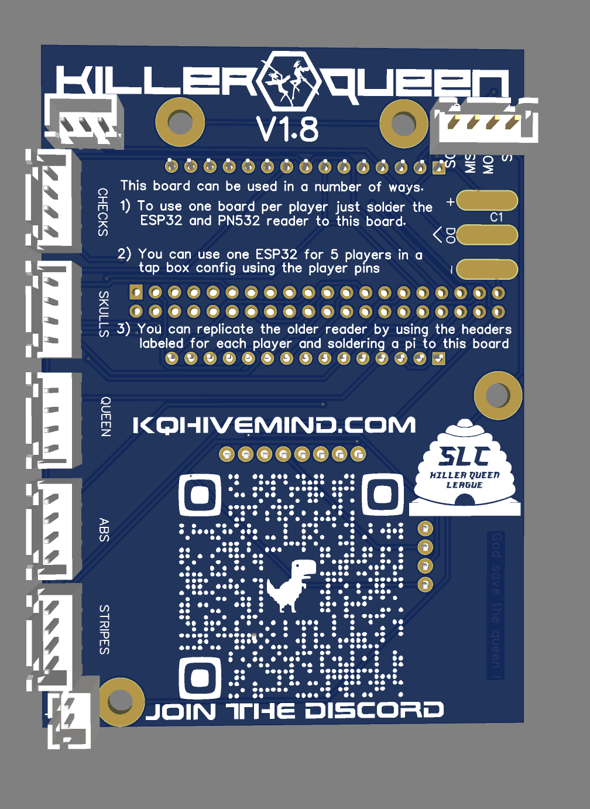
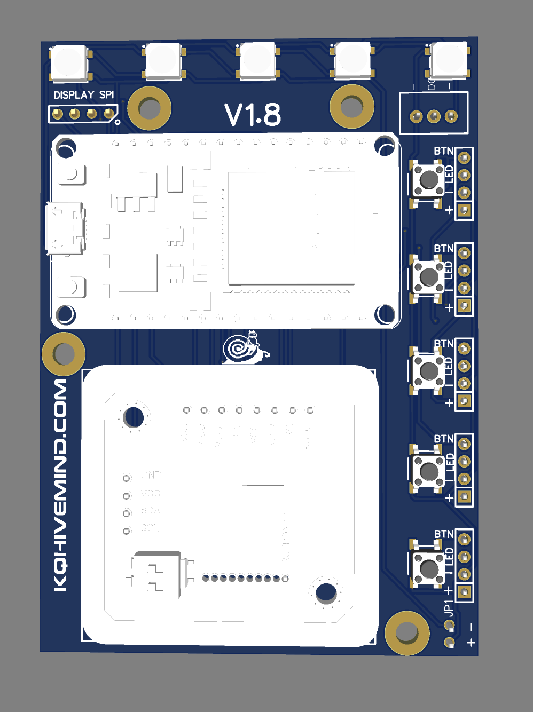

# hivemind_esp32
A open sourced board design, and firmware to work with an esp32, pn532, and kqhivemind.com

## Simple install
// need to update this secion for compiled firmwares

## How to compile and install firmware
1) Install the arduino IDE
2) Install requirements
  - install boards (Tools -> Board -> Board manager)
    - Search and install esp32
  - Install libraries (Sketch -> Include library -> Manage libraries)
    - ArduinoJson by Benoit Blanchon
    - HttpClient by Adrian McEwen
    - Adafruit PN532 by adafruit
    - WiFiManager by tablatronix
    - ArduinoWebsockets by Gil Maimon
3) Set your information in the hivemind_config files
4) Select board (Tools -> Board -> ESP32 Arduino -> ESP32 Dev Module)
5) Select part (Tools -> Port -> YOUR BOARD PORT)
6) Upload (button on the top left with an arrow)

## Issues you might have
1) esptool.py crashing for no real reason
  - to fix this drop the upload speed down, try 115200
  

## Board design
Schematic overview | Back of board | Front of board
--- | --- | ---
 |  | 
